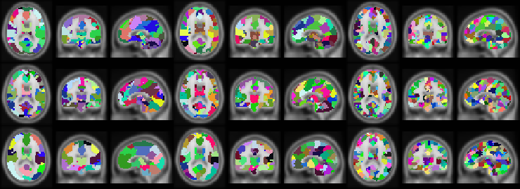
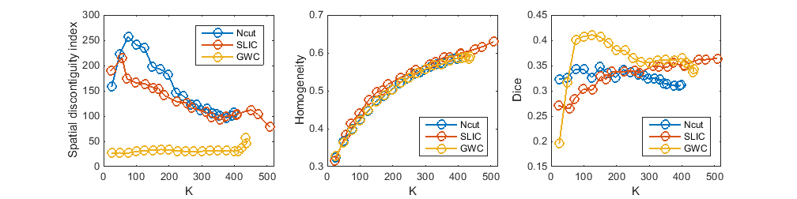

# Generating individual atlases with whole brain resting-state fMRI data by learning the graph and parcellation simultaneously 

MATLAB experiments comparing Ncut, SLIC, and graph-without-cut parcellation for individual resting-state fMRI data.

Copyright (C) 2017 Jing Wang

This toolbox includes three individual subject level whole-brain 
parcellation approaches, i.e., normalized cuts (Ncut), simple linear 
iterative clustering (SLIC), and graph-without-cut (GWC). A demo which 
applies the three approaches on the resting-state fMRI data of three 
subjects from the Beijing_Zang dataset (of the fcon_1000 project) is 
provided in this toolbox. 

<table style="width:100%; table-layout:fixed;">
  <tr>
    <td></td>
    <td></td>
  </tr>
  <tr>
    <td>Illustrations</td>
    <td>Comparison</td>
  </tr>
</table>

## Prerequisites and Execution

Use MATLAB with Parallel Computing Toolbox and run from the repository directory. [m0_download.m](m0_download.m) expects `NIfTI_20140122.zip` and `SLIC_individual_data.zip` and attempts to download missing archives. Review the cluster range and `nPar` in [m1_unzip.m](m1_unzip.m) before running.

Preparation decompresses and deletes root-level `*.gz` files before moving subject images into `data/`. Use a dedicated experiment directory. The historical download endpoints have not been revalidated.

## Quick Start
Run main.m to play the demo. 

## Notes
1. You may download the NIFTI toolbox and the demo data manually.  
2. For parallel computing, carefully choose the number of parallel workers
   to make the most of the hardware resources and to avoid problems such
   as the out of memory problem.

## Related Projects
1. Scripts for the paper: A supervoxel-based method for groupwise whole 
   brain parcellation with resting-state fMRI data.   
      SLIC: http://www.nitrc.org/projects/slic  
      SLIC: https://github.com/yuzhounh/SLIC  
      SLIC_atlas: https://github.com/yuzhounh/SLIC_atlas  
2. Scripts for the paper: Parcellating whole brain for individuals by 
   simple linear iterative clustering.  
      SLIC_individual: https://github.com/yuzhounh/SLIC-individual

## Repository Structure

- [main.m](main.m): workflow.
- [m0_download.m](m0_download.m) and [m1_unzip.m](m1_unzip.m): inputs.
- [m4_parcellation.m](m4_parcellation.m) and [m5_evaluation.m](m5_evaluation.m): experiments.
- [GWC.m](GWC.m), [Ncut_sub_parc.m](Ncut_sub_parc.m), and [SLIC_sub_parc.m](SLIC_sub_parc.m): methods.

## References
1. Jing Wang, and Haixian Wang. "A supervoxel-based method for groupwise 
   whole brain parcellation with resting-state fMRI data." Frontiers in 
   human neuroscience 10 (2016).  
2. Jing Wang, Zilan Hu, and Haixian Wang. "Parcellating whole brain for 
   individuals by simple linear iterative clustering." International 
   Conference on Neural Information Processing. Springer International 
   Publishing, 2016.

## License

See the existing [GPL-3.0 license](LICENSE).

## Contact
Jing Wang  
wangjing0@seu.edu.cn  
yuzhounh@163.com  
2017-12-14 17:14:19
